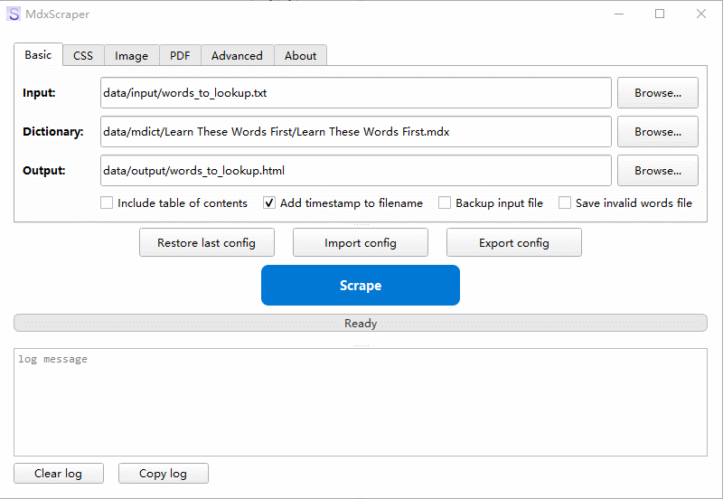

# MdxScraper

## 简介

一句话：根据指定词汇，从 MDX 字典提取内容并输出为 HTML、PDF 或 WEBP/PNG/JPG。



[`视频演示`](docs/screencast.mp4)

## 特点

1. 支持更多输入文件格式，包括 TXT/Markdown/JSON/Excel
2. 支持更多输出文件格式，包括 HTML/JPG/PNG/WEBP/PDF
3. 全面兼容常见 .mdx 词典：
    * 支持多 mdd 的词典（内置并升级 mdict-query）
    * 兼容有或无 CSS 文件的词典
    * 兼容内嵌的各种图片，支持多种图片格式、img 标签多种写法等
4. 采用图形界面(PySide 6)，提升智能化、增强人性化体验
    * 配置选项灵活丰富，包括 Basic、Image、CSS、PDF 等主要类别
    * 通过配置方案导入导出即可快速切换，轻松应对不同场景
    * 可选备份原始词汇，数据安全有保障
    * 可选增加时间戳到输出文件名，方便文件多版本管理
    * 可选输出“无效词汇”清单，通过它可轻松改用其他词典再次查询
5. 跨平台，兼容 Windows/MacOS/Linux

## 安装

1. **克隆仓库或直接下载到任意目录：**
   ```bash
   git clone https://github.com/VimWei/MdxScraper
   ```
2. **安装 Python 运行环境：**
   ```bash
   # 2.1 安装 uv （Python 虚拟环境管理器）
   ## Windows (PowerShell)
   powershell -ExecutionPolicy ByPass -c "irm https://astral.sh/uv/install.ps1 | iex"
   ## Linux/macOS
   curl -LsSf https://astral.sh/uv/install.sh | sh
   # 2.2 同步 python 环境
   cd MdxScraper
   uv sync
   ```
3. **安装 wkhtmltopdf:**
   输出图片和 PDF 时，需要用到它，请访问其官网下载安装
   * https://wkhtmltopdf.org/downloads.html

## 使用

1. 启动程序
    * 方法 1: (Windows) 直接双击 `MdxScraper.vbs`。
    * 方法 2: (Windows/Linux/macOS) 命令行输入：`uv run mdxscraper`
2. 按需配置参数，主要是 输入/词典/输出，其他都是高级选项，慢慢探索
3. 点击按钮 Scrape，查看输出成果

### 用户数据目录

MdxScraper 使用 `data/` 目录作为用户数据存储位置，所有用户相关的文件都存储在此目录下：

```
data/                               # 用户数据目录（可删除重建）
├── configs/                        # 配置文件目录
│   ├── config_latest.toml          # 最近一次配置方案
│   ├── pdf/                        # PDF 样式方案目录
│   ├── css/                        # CSS 样式方案目录
│   └── ...                         # 用户保存的配置方案
├── input/                          # 输入文件目录，存放待查询的词条文件
│   ├── words_to_lookup.txt         # 词条文件案例
│   └── ...                         # 用户创建的词条文件
├── output/                         # 输出文件目录，存放生成的输出文件
│   └── ...                         # 各种输出文件
└── mdict/                          # 存放 .mdx 词典文件，建议分目录存放不同词典
    ├── CC-CEDICT/                  # 中英词典
    └── ...                         # 更多词典文件
```
