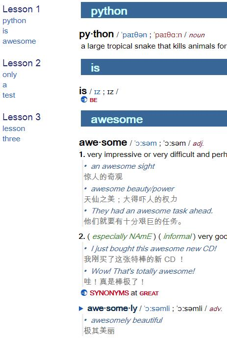
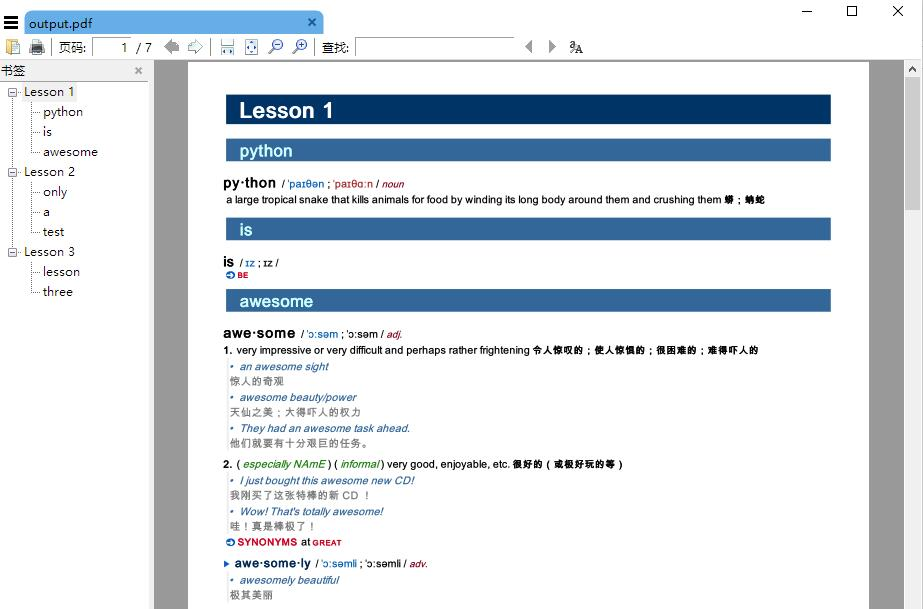

# MdxScraper

## 简介

一句话：根据指定词汇，从MDX字典提取内容并输出为HTML、PDF或JPG。

详情：MdxScraper 是在 [MdxConverter](https://github.com/noword/MdxConverter) 基础上升级改造：

1. 提升词典兼容性：
    * 内置mdict-query，并升级支持多mdd的词典
    * 兼容有或无CSS文件的词典。
    * 兼容img标签的多种写法。
    * 兼容支持png、jpg、jpeg、gif等参见图片格式。
    * 支持同一个页面多次重复引用同一图片的情形，如读音图标等。
2. 提升跨平台兼容性：
    * 文件路径名，兼容跨平台的多种的写法。
    * wkhtmltopdf安装目录，兼容跨平台的多种情形。
3. 重构程序，更加简洁、易用：
    * 采用配置文件方式，而非命令行参数，更加友好。
    * 丰富可配置选项，包括输入输出文件、词典文件、PDF排版、CSS等。
    * 增加时间戳到输出文件名中，方便保留所有输出文件，方便归档查阅。
    * 输出信息更加友好，完善程序状态、查询统计、输出地址、耗时等信息。

## 安装

1. 安装以下第三方库
    * pip install imgkit
    * pip install pdfkit
    * pip install openpyxl
    * pip install chardet
    * pip install base64
    * pip install bs4

2. 安装wkhtmltopdf
    * https://wkhtmltopdf.org/downloads.html

## 使用

1. 配置参数：settings.py
2. 运行程序：python MdxScraper.py

## 高级技巧

* 说明：为了使程序更加可维护和提升使用体验，建议安装和使用环节采用本高级技巧。
    - 本技巧非必须，是可选项。
    - 本技巧适用Window平台，其他平台同理。

1. 安装：使用miniconda配置独立的运行环境，避免其他程序干扰
    * 建立环境：conda create -n MdxScraper python
    * 进入环境：conda activate MdxScraper
    * 安装第三方库：同上
2. 配置：在程序根目录下创建快捷键Conda MdxScraper.lnk，并右键/属性/目标
    * 填入：
    ```
    %windir%\System32\cmd.exe "/K" C:\Users\YOURNAME\miniconda3\Scripts\activate.bat C:\Users\YOURNAME\miniconda3\envs\MdxScraper & cd c:\Apps\MdxScraperLocal\ & MdxScraper.py
    ```
    * 修订：根据你的系统情况更改上述YOURNAME和MdxScraper程序目录
    * 目的：该快捷键让我们可直接进入conda的MdxScraper环境，并执行python程序：MdxScraper.py
3. 日常使用：
    * 配置参数：settings.py
    * 运行程序：双击快捷键Conda MdxScraper.lnk，完成

## 案例演示

* 输入（支持txt、json和excel）
    * input\words_to_lookup.txt
    * input\words_to_lookup.json
    * input\words_to_lookup.xlsx

* 输出（支持html、pdf和jpg）
    * 
    * 
