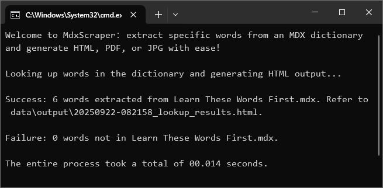

# MdxScraper

## 简介

一句话：根据指定词汇，从MDX字典提取内容并输出为HTML、PDF或JPG。



## 特点

MdxScraper 是在 MdxConverter 基础上升级改造：

1. 提升词典兼容性：
    * 内置并升级mdict-query，支持多mdd的词典。
    * 兼容有或无CSS文件的词典。
    * 兼容html中img标签的多种写法。
    * 兼容支持png、jpg、jpeg、gif等常见图片格式。
    * 支持同一个页面多次重复引用同一图片的情形，如读音图标等。
2. 提升跨平台兼容性：
    * 文件路径名，兼容跨平台的多种的写法。
    * wkhtmltopdf安装目录，兼容跨平台的多种情形。
3. 重构程序，更加便捷、易用、强健和友好：
    * 采用配置文件方式，而非命令行参数，配合 uv 可以一键输出，更便捷。
    * 丰富配置选项，包括输入输出文件、词典文件、PDF排版、CSS等，更强大。
    * 输出信息增加程序状态、查询统计、输出地址、耗时等信息，体验更友好。
    * 备份原始词汇，并与输出文件放在一起，方便归档调阅，数据安全有保障。
    * 增加时间戳到输出文件名，方便归档查阅所有输出文件，文件管理更方便。

## 安装

To set up the project locally, you will need a working Python environment (Python 3.11+ required).

1. **Clone the repository:**
   ```bash
   git clone https://github.com/VimWei/MdxScraper
   cd MdxScraper
   ```

2. **Install uv (fast Python package manager):**
   ```bash
   # Linux/macOS
   curl -LsSf https://astral.sh/uv/install.sh | sh

   # Windows (PowerShell)
   powershell -ExecutionPolicy ByPass -c "irm https://astral.sh/uv/install.ps1 | iex"
   ```

3. **Install dependencies:**
   ```bash
   # Install all dependencies with exact versions
   uv sync
   ```

4. **Install wkhtmltopdf (optional, for PDF):**
   * https://wkhtmltopdf.org/downloads.html

## 日常使用

1. 配置参数：settings.py
2. 运行程序：
    * 方法1: (windows) 直接双击运行文件 `MdxScraper.vbs`
    * 方法2: (Windows/Linux/macOS) 命令行输入 `uv run python MdxScraper.py`

## 案例


